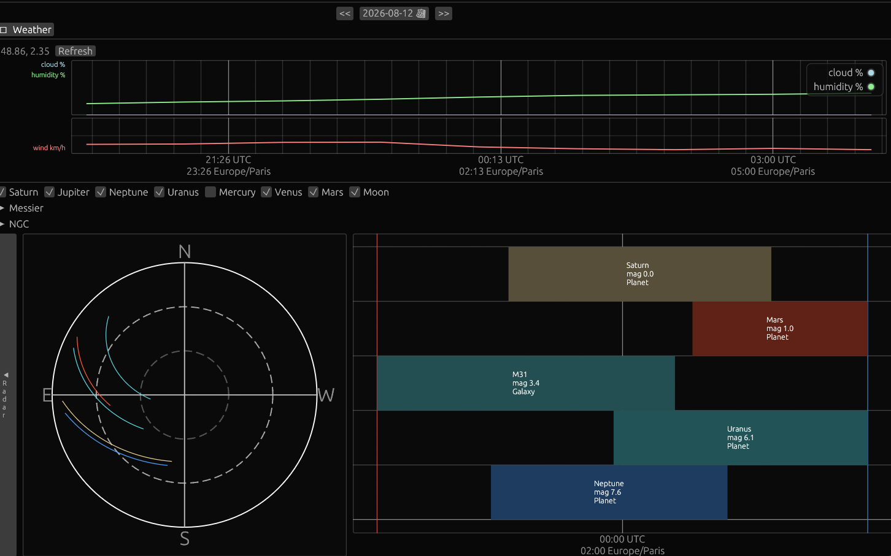

# AstroCalc

A desktop observation planner for night-sky photography and visual astronomy.

Pick your site, define the parts of the sky you can actually see, then find when targets are worth looking at — without recomputing the night every time you open the app.



## What you can do

- **Set up your sites** — place yourself on a map, draw azimuth visibility zones, and save named configurations for quick switching
- **Explore a single night** — sky map and timeline for one evening; selecting a date caches that night plus ~10 days ahead in the background
- **Scan multiple nights** — Night Tracks timeline from cache (twilight background, altitude-colored segments), with the same catalog selection as Daily
- **Check observing conditions** — weather context (clouds, humidity, wind) for the selected location and night
- **Plan ISS views** — dedicated ISS tab: ~60-day list of sunlit dusk/dawn passes and Sun/Moon disk transit/near-miss opportunities (fresh TLE from Celestrak)

## Coming next

- Weather as a planning / visibility input
- Complete Sun handling alongside planets and Moon
- Deeper magnitude / FOV planning filters shared across object kinds

## Status

Early and actively developed. Solar-system and deep-sky nightly planning, Daily visualization, Night Tracks multi-night timeline, weather, and a dedicated ISS opportunities view are usable today.

## Download

Prebuilt binaries for Windows, macOS (Apple Silicon), and Linux are published on the [Latest release](https://github.com/fanff/astrocalc/releases/latest) page whenever `main` is updated. Grab the archive for your OS, extract it, and run the binary.

## Run

Requires a Rust toolchain.

```bash
cargo run
```

On first run, a `Default` configuration is seeded for Paris center with a near-full north-facing view window. Config shows each zone's azimuth wedge on the location map and can save, name, and quickly switch between multiple configurations stored in SQLite.

Copy `.env.example` to `.env` if you want a local database URL override (`DATABASE_URL`). Migrations under `migrations/` run automatically at startup.

## More detail

Design notes and backlog live under [`doc/`](doc/).
